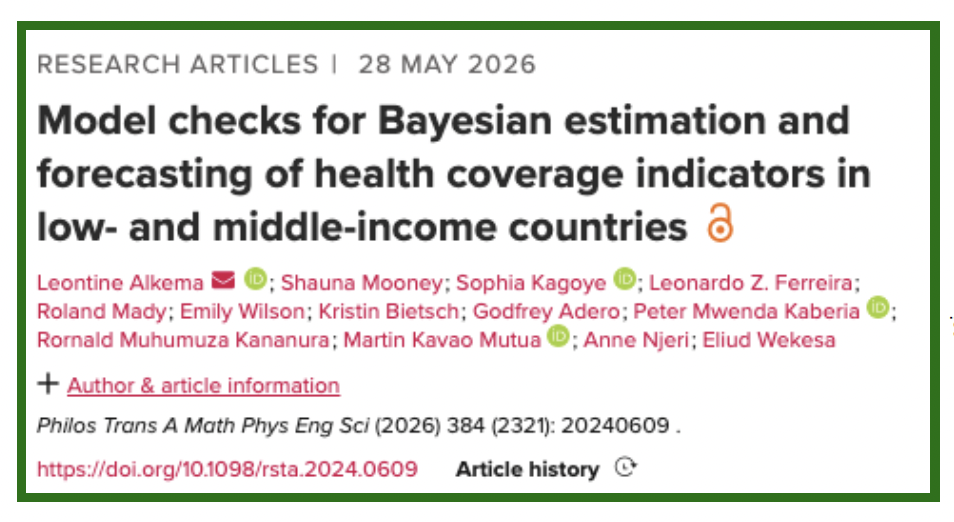
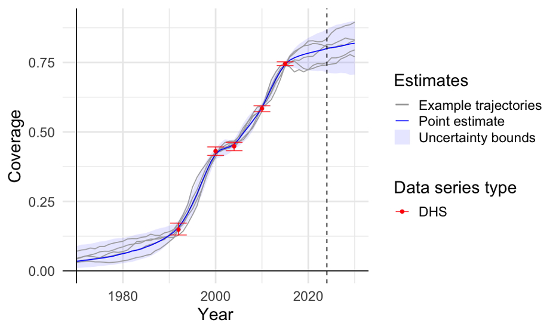
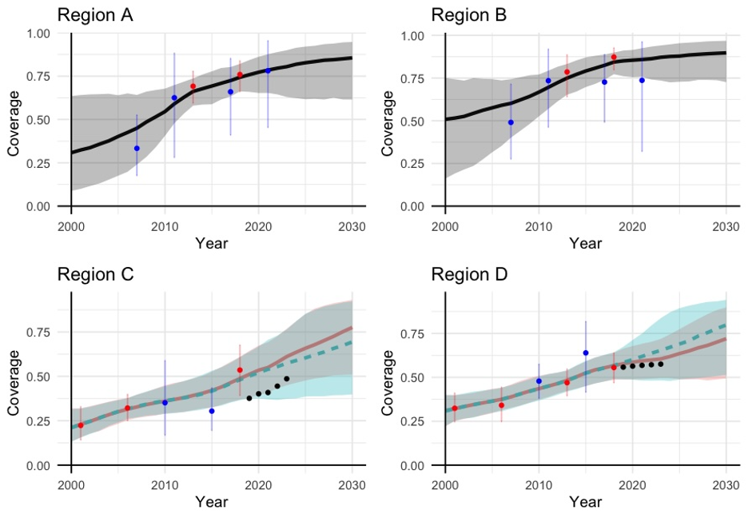

# Summary

We developed a Bayesian model to estimate and forecast coverage indicators using survey data and routine data. The approach builds on to the Family Planning Estimation Tool (FPET). It produces estimates and forecasts (2010 - 2030) for a range of coverage indicators including ANC 1st trimester, ANC4, institutional deliveries, penta3, the CCI, and measles1. The modeling approach is available in R packages and included in the Countdown data suite.

This work was supported, in whole or in part, by the Gates Foundation (INV-001299).

For questions or suggestions, please contact: Leontine Alkema (lalkema\@umass.edu).

# Approach

## Reference

- L. Alkema, S. Mooney, S. Kagoye, L. Ferreira, R. Mady, E. Wilson, K. Bietsch, G. Adero, P. Kaberia, R. Kananura, M. Mutua, A. Njeri, E. Wekesa (2026). Model checks for Bayesian estimation and forecasting of health coverage indicators in low- and middle-income countries. *Philosophical Transactions A* 384 (2321): 20240609. <https://doi.org/10.1098/rsta.2024.0609>

## Background

Reliable information on health coverage indicators is essential for monitoring progress, informing programs, and guiding policy decisions. However, relying on survey and routine data alone is often challenging. Routine data from facilities may suffer from underreporting or inconsistent data quality, while survey data may be uncertain or not recent. To address these challenges, statistical models can be used to produce estimates and forecasts over time, combining multiple data sources and accounting for their limitations. This results in estimates of coverage every year (between data points and past data) with an indication of how certain/uncertain we are about each year. As a result, models enable more complete, accurate, and timely assessments of health coverage, especially in data-limited settings.

## Producing estimates and short-term forecast of coverage indicators

We developed a statistical model to estimate health coverage up at the national level and for subnational regions to the most recent year with data and to make short-term forecasts for the years ahead. The model looks at the available data and identifies different ways coverage could have changed over time. Each of these possible paths is called a trajectory (see Figure). For each year, we report a best estimate (the middle value across all trajectories) and a range that shows the uncertainty (leaving out the most extreme possibilities at the edge).

Informed by global analyses, the model captures that over time coverage usually rises from low to high levels, following an S-shaped trend, with periods of faster or slower progress along the way depending on what the data indicates. It uses survey and routine data to choose trajectories that match what has been observed. The model also draws on trends seen in other areas with similar coverage levels.

## How are survey data used?

Survey data help us understand coverage, but they come with some uncertainty. This happens because surveys only include a sample of the population, not everyone, and there can be errors during data collection.

To best use survey data, the model tries to strike the right balance—smoothing out random ups and downs that are probably not real, while still capturing important patterns in the data. To do this, the model looks at how uncertain each data point is. If a data point is very uncertain, it will have less impact on estimated coverage (the model gives it less weight and is more likely to smooth over it). On the other hand, if a data point is more reliable, estimates will align closer to that value.

For subnational regions, the model uses survey data from the specific region when available.

**Figure 1: Illustration of how coverage could have changed over time based on survey data.** The grey lines represent examples of the possible coverage trajectories that fit the data, showing a range of plausible trends. Red points mark the actual survey data, while the solid line shows the model’s best estimate. The shaded area around the estimate represents uncertainty intervals, indicating the range within which the true coverage is likely to fall.

## How are routine data used?

The coverage estimates from routine data can be biased, so the model treats it differently from survey data. For surveys, the model uses the actual coverage levels. For example, if a survey indicates coverage at 60% for a particular year, the model uses that value directly. In contrast, routine data can be biased due to issues such as incomplete reporting and data collection inconsistencies. Due to this, the model does not rely on coverage levels observed in routine data. Instead, the model focuses on the trend over time, specifically, how coverage changes from year to year. For example, if routine data shows coverage increasing from 50% in 2020 to 53% in 2021, the model interprets this as a 3 percentage point increase. If the routine data shows faster or slower changes than expected, the model adjusts the estimates—but only as much as the data can be trusted.

The model accounts for routine data quality by adjusting the uncertainty of the trend estimates. Observations with lower data quality are treated as more uncertain and given less weight in determining true rates of change. Specifically, uncertainty in the estimated rate of change increases as the Countdown mean data quality score decreases. Consequently, lower-quality data exerts less influence on the modeled rate of change.

## Illustrative examples

Estimates are produced for the proportion of women who receive the recommended minimum of at least four antenatal care visits during pregnancy (referred to as ANC4), the proportion of live births that take place in a health facility (referred to as institutional deliveries), and the proportion of children who receive the recommended three doses of pentavalent vaccine (referred to as vaccination coverage).

The figure below shows example data and estimates obtained from the model for a coverage indicator in four different regions. The plots show that the model’s estimates usually follow the survey data, unless a data point is very uncertain and does not match the overall trend. For example, in Region B, the most recent MICS survey point is lower than expected and very uncertain, so the model’s recent estimates do not exactly align with this survey.

We also see that routine data help inform how quickly coverage is changing over time, particularly after the most recent survey, when no new survey data is available. For example, in Region C, the routine data show an increase in coverage. As a result, the estimates that include routine data show a faster rate of change during that period compared to the estimates based only on survey data. In contrast, in Region D, routine data suggest that coverage has not increased recently and estimates that include routine data reflect that information.

**Figure 2: Example data and estimates.** Survey data from DHS and MICS are shown in red and blue, with vertical bars indicating how uncertain each survey point is. Routine data are shown in black. The lines represent the model’s point estimates with shaded areas highlighting uncertainty (in red if routine data were included, black/green otherwise).

# Software

The Bayesian model can be fitted quickly to country data through an R Shiny app available at <https://github.com/AlkemaLab/bayescoverage_app>. Modeled estimates can also be obtained through the Countdown data suite, see <https://datasuite.vercel.app/en>.

Further details: The modeling is based on the R package `bayescoveragemodel`, see <https://alkemalab.github.io/bayescoveragemodel/>. However, to avoid installation issues related to C++ compilers, we added the Bayescoveragedeploy package, see <https://github.com/AlkemaLab/bayescoveragedeploy/>, which contains precompiled Stan models. Through the deploy package, you can use the Shiny app without needing to install cmdstanr etc on your machine. The deploy package is available here: <https://alkemalab.r-universe.dev/builds>
