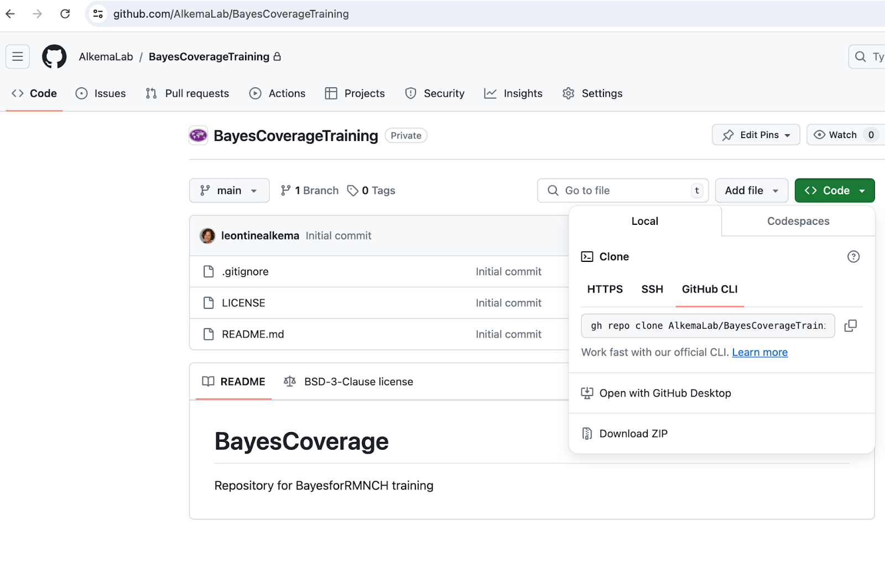
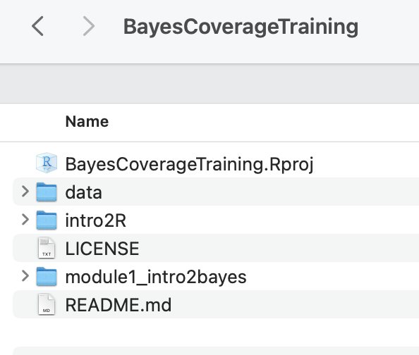

# Overview

This page includes slides and recordings to learn about Bayesian modeling. The training is divided into 3 main modules:

1.  Introduction to Bayesian inference and Bayesian modeling in global health

2.  How to exchange information between populations: Hierarchical models (also called multilevel models)

3.  Introduction to Bayesian modeling of coverage indicators and the Family Planning Estimation Tool (FPET)

In each module, topics include conceptual understanding as well as hands-on analysis and modeling exercises.

Code for the Bayesian modeling training is available in a public repository (repo) on Github: <https://github.com/AlkemaLab/BayesCoverageTraining>. We use the open-source software R for analyses and computations, through its user-friendly interface [R-studio](https://posit.co/products/open-source/rstudio/). For model fitting, R packages and extensions are used such that all analyses take place in R. Analysis scripts will be provided for example analyses and discussed in recordings. Additional resources for learning R and git(hub) are included at the end of this page.

# Background

Why would we want to introduce Bayesian statistical models to produce estimates and forecasts for Countdown coverage indicators?

- Link to [slides](https://drive.google.com/file/d/1NP_WYZ5ffhWL1b4AY8v0Kd4HFWwMx8_w/view?usp=sharing "Slides 0 intro")

- Link to [recording](https://drive.google.com/file/d/1XREbv8VWpi_EwR86b_jazfzv0BxsA-e5/view?usp=drive_link "Recoding 0 intro")

# Module 1: Introduction to Bayesian inference

## Unit 1: Let’s think like a Bayesian!

Material:

- link to [slides](https://drive.google.com/file/d/1z9NJUKhz69qRXmkAG9oUQwf897amQBMX/view?usp=sharing)

- link to [recording](https://drive.google.com/file/d/1iCdMeuFPDq-WXhSOat8dH748pndwi9CL/view?usp=sharing)

## Unit 2: Bayesian inference for a population proportion

Material:

- link to [slides](https://drive.google.com/file/d/1EiTjmIk7b0hTnQuV7Y7BcIr4xGi_nPMG/view?usp=sharing)

- link to [recording](https://drive.google.com/file/d/13G8Ww5woPQ-vUDsxZyS4psiIGANfOFSL/view?usp=sharing), note that the start of the recording has an issue with the screen capture of the title slide but that resolves itself on the 2nd slide.

## Unit 3: More details on Bayesian inference and Bayes’ rule for estimating a population proportion

Material:

- link to [slides](https://drive.google.com/file/d/1AcOfCtARyVf11UpO3bAucVHam1tzAEKa/view?usp=sharing)

- link to [recording](https://drive.google.com/file/d/1iWz9xb3bLm4HK3FQDXJ5UUVNW7tqlhda/view?usp=sharing)

- link to R notebook to do Bayesian inference for a population proportion is saved in our github repo in the folder module1, direct link [here](https://github.com/AlkemaLab/BayesCoverageTraining/blob/main/module1_intro2bayes/everythingisnormal.Rmd).

## Unit 4: Why Bayesians like sampling so much

Material: simulation-based inference, Monte Carlo approximation

- link to [slides](https://drive.google.com/file/d/17i2EpJstz3RiotKdiqNtv9EtN-4lOx8I/view?usp=sharing)

- link to [recording](https://drive.google.com/file/d/1KsYvfjG-sFcVnBoqDhMBi8dZFqUqmzOL/view?usp=sharing)

## Unit 5: Introduction to MCMC

Material:

- link to [slides](https://drive.google.com/file/d/116QZYxGuqqjy2PuptFHPbUvpLBFVAyJp/view?usp=sharing)

- link to [recording](https://drive.google.com/file/d/1zndVu8Ax1zpJrFwq61CTOGtIger7QCHt/view?usp=sharing)

## Unit 6: Let's Stan!

The slides and recording start with a summary of units 4 and 5, followed by unit 6. The recording ends with a demo of how to get started with brms using the notebook:

- link to [slides](https://drive.google.com/file/d/144IS40rfKVEiArZIVZJ8bWyR01pHsb1i/view?usp=sharing)

- link to [recording](https://drive.google.com/file/d/1EH3j-qUFnmkA-gA008ETax--cYXBb77r/view?usp=sharing)

- R notebook to get started with brms (saved in our github repo in the folder module1, direct link [here](https://github.com/AlkemaLab/BayesCoverageTraining/blob/main/module1_intro2bayes/brms_gettingstarted.Rmd))

Once you can run the brm-function, use this notebook to check out more examples of fitting Bayesian regression models using brm:

- Link to [R notebook](https://github.com/AlkemaLab/BayesCoverageTraining/blob/main/module1_intro2bayes/brms_fitregressionmodels.Rmd) in repo and the corresponding [knitted pdf](https://drive.google.com/file/d/1T6Juh2eg3CULtVHnpLzPwoJ7Xu4_1Tkx/view?usp=sharing)

# Module 2: Hierarchical (or multilevel) models

In this module, we're going to discuss how to exchange information between populations using hierarchical models, which are also called multilevel models, and fit such models using the brm function.

To introduce the topic, we are using material from a different course:

- Unit 1 (referred to as module 7 in the course): [slides](https://umass-my.sharepoint.com/:b:/g/personal/lalkema_umass_edu/ERv8djoD_rdDjCy9a5ayYOQBNDZZt2nBzCCZ2otWzMJgBg?e=d0c2rC) and [recording](https://umass-my.sharepoint.com/:v:/g/personal/lalkema_umass_edu/EYH_zu8bguFNnsMel7NerxIBYwe1geB4bA9_jvviBJs7zw?nav=eyJyZWZlcnJhbEluZm8iOnsicmVmZXJyYWxBcHAiOiJPbmVEcml2ZUZvckJ1c2luZXNzIiwicmVmZXJyYWxBcHBQbGF0Zm9ybSI6IldlYiIsInJlZmVycmFsTW9kZSI6InZpZXciLCJyZWZlcnJhbFZpZXciOiJNeUZpbGVzTGlua0NvcHkifX0&e=UCLcFW)

- Unit 2 (referred to as module 8 in the course): [slides](https://umass-my.sharepoint.com/:b:/g/personal/lalkema_umass_edu/EboMuHtYaJRAj3mY_jC0_lUBfY0z5jThL6JWKR9kidRO-g?e=FIgXW5) and [recording](https://umass-my.sharepoint.com/:v:/g/personal/lalkema_umass_edu/EcpihxEcPwlCpH0p2GDT2hcBtlntRxc8dtS0FkYlAWbnZA?nav=eyJyZWZlcnJhbEluZm8iOnsicmVmZXJyYWxBcHAiOiJPbmVEcml2ZUZvckJ1c2luZXNzIiwicmVmZXJyYWxBcHBQbGF0Zm9ybSI6IldlYiIsInJlZmVycmFsTW9kZSI6InZpZXciLCJyZWZlcnJhbFZpZXciOiJNeUZpbGVzTGlua0NvcHkifX0&e=Owprd0)

The example used in this material is the estimation and prediction of radon levels in counties in the US. Radon is a naturally occurring radioactive gas. Its decay products are also radioactive; in high concentrations, they can cause lung cancer (several 1000 deaths/year in the USA). Radon levels vary greatly across US homes. The data we work with contains radon measurements from different counties in the US. One final goal in the two units is to predict radon levels for a specific country or in a non-sampled house using a Bayesian hierarchical regression model. The application was originally taken from the book Gelman and Hill (2006). Data Analysis Using Regression and Multilevel/Hierarchical Models. Cambridge University Press.(A great book but outdated now wrt computation; remind me to post a list of references with more recent books!)

Note that in this material, the second unit gets a little more technical and may be beyond what some of you are looking for in this training. Please do go through the material, focusing on trying to understand the main points (i.e, what type of models and predictions are discussed). As usual, feel free to post any questions or comments on slack. We can have more technical discussions if there is an interest, during our meetings or over slack.

In our group meetings, we will do hands-on exercises that focus on estimating modern contraceptive use (mCPR). For our first meeting, the exercise concerns the estimation of country-specific mCPR for a given time period using the hierarchical model from unit 1. For the second meeting, we will fit hierarchical regression models to estimate country-year specific mCPR, applying the different types of models introduced in unit 8.

# **Module 3:** Introduction to Bayesian modeling of coverage indicators and the Family Planning Estimation Tool (FPET)

Update June 2026: this information is outdated and will be updated soon!

Now that we are familiar with Bayesian inference and hierarchical models, we can start to consider model classes and model building blocks that are needed to develop a Bayesian model to estimate and forecast a coverage indicator for a population and time period of interest. We consider a general class of Bayesian hierarchical temporal models that includes the Family Planning Estimation Tool (FPET), a model that is used for estimating and forecasting family planning indicators such as modern contraceptive use, based on survey and routine data. 

To introduce FPET, this module discusses the following topics:

1.  A general model class referred to as Temporal Models for Multiple Populations (TMMPs). The class makes a distinction between the process model, which describes latent trends in the indicator interest, and the data model, which describes the data generating process of the observed data. To start with a general introduction to this class, please consider reading paper 1 below.

2.  What assumptions to make about indicators and how they change with time: Time series process models, focused on transition models, as described in papers 2 and 3 below.  

3.  How to best use data to inform estimates: Data models for survey and routine surveillance data, as described in papers 3 and 4 below.   

Readings

1.  Introduction to TMMPs \[focus on the general class as introduced in section 3, consider case studies based on your interest\]: Susmann, Herbert, Monica Alexander, and Leontine Alkema. “Temporal Models for Demographic and Global Health Outcomes in Multiple Populations: Introducing a New Framework to Review and Standardise Documentation of Model Assumptions and Facilitate Model Comparison.” *International Statistical Review* 90, no. 3 (2022): 437–67. <https://doi.org/10.1111/insr.12491>.

2.  Introduction to transition models \[focus on the general set up\]: Susmann, Herbert, and Leontine Alkema. “Flexible Modeling of Demographic Transition Processes with a Bayesian Hierarchical Penalized B-Splines Model.” arXiv, 2023. <https://doi.org/10.48550/arXiv.2301.09694>.

3.  FPET overview paper, it discusses the process model and data models for survey data and routine data: Alkema, Leontine, Herbert Susmann, Evan Ray, Shauna Mooney, Niamh Cahill, Kristin Bietsch, A. A. Jayachandran, et al. “Statistical Demography Meets Ministry of Health: The Case of the Family Planning Estimation Tool.” arXiv, 2024. <https://doi.org/10.48550/arXiv.2501.00007>.

4.  Details on how survey data are used in FPET: Alkema, Leontine, Herbert Susmann, and Evan Ray. “Temporal Models for Demographic and Global Health Outcomes in Multiple Populations: Introducing the Normal-with-Optional-Shrinkage Data Model Class.” arXiv, 2024. <https://doi.org/10.48550/arXiv.2411.18646>.

# Resources for learning R and git(hub)

The remainder of this page contains resources for those of you new to R, and a workflow for non-Github users.

## Steps to get set up with R/R studio for new users

### Step 1: Download and install R and Rstudio

Go to <https://posit.co/download/rstudio-desktop/> and follow instructions to install R and Rstudio on your own computer (first install R, then R studio). 

### Step 2: Download the BayesCoverageTraining material from github

All code for this course will be made available in a public repository (repo) on Github: <https://github.com/AlkemaLab/BayesCoverageTraining>.  

The text below introduces Github and a workflow for non-Github users. Participants who are familiar with github can ignore that workflow and work with the repository directly. 

#### Instructions for those new to Github

Github refers to a hosting service for projects that use a version control system (git). Many programming projects, such as R packages, use Github repositories and the git version control system such that several people can work together and contribute to the project. Rstudio has nice functionality to work with and contribute to Github repositories. However, it requires some learning to get started with it. Hence, to avoid too much learning at once, we introduce a workflow that does not require any knowledge or experience with git(hub) for new users. If you are interested in learning more about git and github, some resources are provided below. We may come back to the use of github when doing collaborative analysis projects.

**When downloading the code for the first time, take the following steps:**

1.  Download the repo 

- Go to <https://github.com/AlkemaLab/BayesCoverageTraining>

- Click on “Code” (green button), then “download zip”, see screenshot 1 below.

{width="679"}

2.  Set up your local folder with your Rstudio project 

- Place the zipped downloaded file in a place where you can find it again: this directory will contain all your R code for the training

- Unzip the downloaded file

- Click on “BayesCoverageTraining.Rproj” to open your project in R studio, see screenshot 2.

{width="417"}

**Code updates/additions:**

New modules will be added as the training progresses. To get the code in your local BayesCoverageTraining folder, you will need to download the new module and add it. 

To do so, we recommend just downloading the entire repository again as per step A above, unzipping, and then selecting the folder that you want to move to your local BayesCoverageTraining folder. (But if you want, note that you can also download individual files (just click on the file you want, and then there is a download button \[downwards arrow\] in the top left).

### Step 3: Open your BayesCoverageTraining R studio project and start working with the code for the module

As explained in Step 3, you will have a local directory with BayesCoverageTraining.Rproj in it. Click on that Rproj file to start working away (see recording [R demo - getting started](https://drive.google.com/file/d/1-E1E9VITuMqB67pVhISZbZhCyY9yYRV-/view?usp=sharing) for a quick intro).

We recommend always to start with opening the project file (to start an R studio session), as opposed to opening just the file you want to use, to have the right set up.

You can add additional files and edit the training files as you want. Just make sure to stick to the folder structure to avoid issues. If you are running into problems after editing a local copy of a file, you can always download a new one and start over.

## Learning R

If you’re completely new to R, we recommend to consider one of gazillion great resources out there to get started in R and R studio. For module 1, we recommend learning a little about Rstudio and R markdown. We added some resources for this below. For later modules, learning about data wrangling (using dplyr), data visualization (using ggplot), and reading/writing data will be helpful. We will add information for this later on in the training. 

*Note on posit cloud computing:* Some introductions to Rstudio use posit cloud services. While this works well to show how Rstudio works (without needing to worry about getting a local set up in order), our trials suggested that it’s not powerful enough for our exercises (fitting even a simple Bayesian model took a long time and resulted in some workspace crashes). So we will stick to using Rstudio locally.

### Books on R and Rstudio

These books are all freely available online:

- R for Data Science (first published in 2017, now on 2(+?) edition, content updated on website). Hadley Wickham and Garrett Grolemund. O'Reilly Media, Inc. <https://r4ds.hadley.nz/>

- Statistical Inference via Data Science: A Modern Dive into R and the Tidyverse (2020). Chester Ismay and Albert Y. Kim. Chapman & Hall/CRC The R Series. <https://moderndive.com>

- (short) courses with great reference material (perhaps some of it is a little outdated by now but intro material, ie on R, R studio, objects, markdown, dplyr basics is still relevant):

  - <https://github.com/rstudio-education/remaster-the-tidyverse>

  - <http://stat545.com/index.html> 

## Other resources

Here are some for starters:

- Great resource in terms of covering the main parts and being to the point.

  - <https://scubed.netlify.app/courses/1_intro_r_tidyverse/>
  - Please note that there is a self-paced version of the course I linked to, you just need to click on free materials <https://introduction-r-tidyverse.netlify.app/>

- Site includes recordings on Rstudio, R markdown

  - <https://datavizf23.classes.andrewheiss.com/lesson/01-lesson.html>

- ...

## For Stata users

Shared by Leonardo Ferreira: For those that are comfortable working with Stata but new to R, I have come across a few cheat sheets that try to translate Stata commands to R. Here is a post with several examples and a two-page cheat sheet in the end.\
<https://www.hertiecodingclub.com/learn/rstudio/stata_to_r/>\
Just good to keep in mind that the way R works is somewhat different from the way Stata does (in terms of structure, environment and objects). So not everything can be translated or thought as if we were coding in Stata.

## Getting going with git(hub)

Some brief steps:

- Get a github account

- Recommended steps to get started using Rstudio build-in functionality: 

  - Connect your Rstudio with github, here is an “how-to-set-it-up” explanation [https://sites.northwestern.edu/researchcomputing/resources/using-git-and-github-with-r-rstudio](https://sites.northwestern.edu/researchcomputing/resources/using-git-and-github-with-r-rstudio/)

  - Consider an Rstudio-based workflow such as this one <https://rfortherestofus.com/2021/02/how-to-use-git-github-with-r>

Once you get going, you may want to learn more. This is a great book: <https://happygitwithr.com/>
