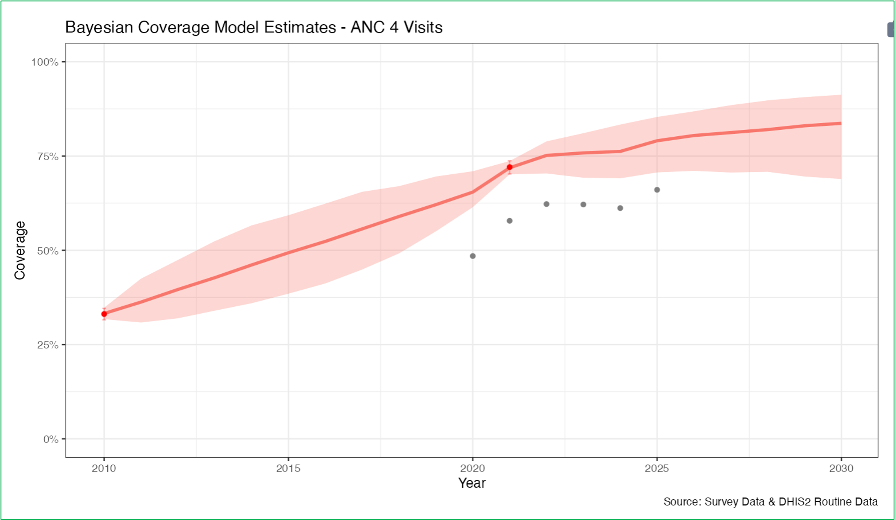
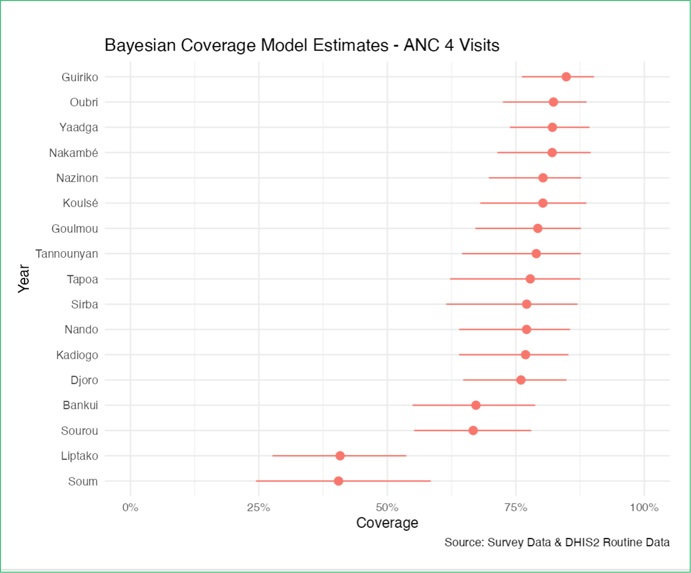

# Software summary

Bayesian coverage estimates can be obtained with the BayesCoverage R packages, an R Shiny app, or through the Countdown data suite.

# BayesCoverage R packages and R Shiny app

The Bayesian model is implemented in R and Stan through the bayescoveragemodel R package, see **https://alkemalab.github.io/bayescoveragemodel/.**

Country-specific models can be fitted quickly using an R Shiny app available at [**https://github.com/AlkemaLab/bayescoverage_app**](https://github.com/AlkemaLab/bayescoverage_app). To simplify installation and avoid C++ compiler issues, the app uses the bayescoveragedeploy package ([**https://github.com/AlkemaLab/bayescoveragedeploy/**](https://github.com/AlkemaLab/bayescoveragedeploy/)), which includes precompiled Stan models. With the deploy package, you can run the Shiny app without installing cmdstanr or other dependencies. The deploy package is available at [**https://alkemalab.r-universe.dev/builds**](https://alkemalab.r-universe.dev/builds).

# Countdown data suite 

The Countdown data suite is available at <https://datasuite.vercel.app/en>, instructions can be found on the website.

An example of the output from the Countdown data suite for ANC4 coverage at the national level is shown in Figure 1 below. The graph displays survey data and routine data as dots (grey for routine data, red for survey data). The red line represents the modeled point estimates, and the red shaded areas represent the 95% uncertainty intervals.

{width="480"}

Example outputs for subnational coverage estimation for 2025 are shown in Figure 2. Red dots represent point estimates, and horizontal lines represent 95% uncertainty intervals.

{alt="Figure 4: Bayesian estimates for admin1 regions. Legend: Bayesian point estimates (red dots) and 95% uncertainty intervals (horizontal lines)." width="584"}
